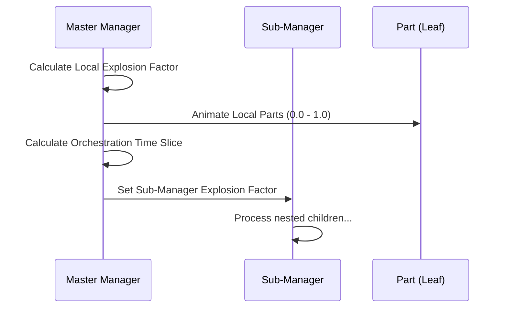

# Exploded View: Under the Hood

## Introduction for Non-Technical Users

This document explains **how** the Exploded View tool works internally. It is designed to give you a deep understanding of the system's "brain" without requiring you to read the code. Think of this as the blueprint of the machine.

---

## 1. The Core Architecture: "The Manager Pattern"

At its heart, the tool follows a **Recursive Manager** design. 

Instead of one single brain controlling every screw and bolt in a massive machine, the tool breaks the problem down into smaller, manageable chunks.

### The Hierarchy Tree
Imagine your 3D model as a family tree:
*   **The Root (Main Manager)**: The big boss (e.g., The Car).
*   **Sub-Managers (Middle Management)**: Major components (e.g., The Engine, The Wheel).
*   **Parts (Workers)**: The actual individual pieces (e.g., A single Piston, A Lug Nut).

**The Rule**: Every Manager is responsible only for its *immediate* children. Use the **Root** to talk to the **Engine**, and the **Engine** talks to the **Piston**.

```mermaid
graph TD
    Root[Root Manager (Car)] -->|Controls| Engine[Sub-Manager (Engine)]
    Root -->|Controls| Wheel[Sub-Manager (Wheel)]
    
    Engine -->|Controls| Piston[Part: Piston]
    Engine -->|Controls| Valve[Part: Valve]
    
    Wheel -->|Controls| Tire[Part: Tire]
    Wheel -->|Controls| Rim[Part: Rim]

---

## 2. Leaf vs. Branch: The Fundamental Distinction

Understanding the difference between a **Leaf** and a **Branch** is key to mastering complex orchestrations.

*   **Leaf (Part)**: An actual 3D mesh (Renderer). It is at the end of the chain. It moves from Home to its Target.
*   **Branch (Sub-Manager)**: A GameObject that has its own `ExplodedView` component. It acts as a container.

### Why it matters
*   **Leaves** are animated by the `Explosion Factor` of their *direct* parent.
*   **Branches** are sequenced by the `Orchestration Factor` of their *direct* parent.

```mermaid
graph LR
    A[Manager A] -->|Explosion Factor| Leaf1[Leaf: Screw]
    A -->|Orchestration Factor| B[Manager B]
    B -->|Explosion Factor| Leaf2[Leaf: Piston]
```
```

---

## 2. The Animation Engine: "The Factor"

The entire system runs on a single number: **The Explosion Factor**.
This is a simple value between `0.0` (Closed) and `1.0` (Open).

### Orchestration Flow
When a Master Manager drives a Sub-Manager, it follows this orchestration flow:



### How Movement is Calculated
When you drag the slider, the tool performs a mathematical calculation called **Linear Interpolation (Lerp)**.

1.  **Start Point**: The tool saves the position of every part when you click "Setup". This is "Home".
2.  **End Point**:
    *   *Spherical*: Calculated automatically based on direction from center.
    *   *Target*: Defined manually by where you placed the "Ghost Object".
3.  **The Blender**:
    *   If Factor is `0.0`, the part is at **Start**.
    *   If Factor is `1.0`, the part is at **End**.
    *   If Factor is `0.5`, the part is exactly halfway.

---

## 3. The Orchestration Brain: "The Ripple Effect"

The sophisticated part of this tool is how it handles thousands of parts without you needing to animate them individually. This is called **Orchestration**.

### The Recursive Loop
When you move the Master Slider on the Root object, it doesn't just move parts. It sends a **Signal** down the tree.

1.  **Root** receives input: "Go to 50%".
2.  **Root** calculates its own parts.
3.  **Root** looks at its list of Sub-Managers (Engine, Wheel).
4.  **Root** passes the baton: "Engine, you go to 50%".
5.  **Engine** wakes up, calculates its pistons, and passes the baton further down.

This chain reaction happens every single frame (60 times a second), creating the illusion of a complex, synchronized machine coming alive.

### Sequential Mode: "The Traffic Cop"

By default, the signal is sent instantly to everyone (Simultaneous). However, when you enable **Sequential Mode**, the Logic changes.

The tool splits the signal timeline in half:

| Global Input (Master Slider) | 0.0 -> 0.5 | 0.5 -> 1.0 |
| :--- | :--- | :--- |
| **Logic Action** | **Move Phase** | **Orchestrate Phase** |
| **What Happens** | The Component moves to its target position. | The Component stays still, but starts opening its children. |

This simple logic split allows for complex "Unpack, then Deploy" animations without writing a single keyframe.

---

## 4. The Data Flow

Here is the exact lifecycle of the system from the moment you click "Setup":

1.  **Discovery Phase**:
    *   The tool scans your object.
    *   It identifies "Significant Parts" (Renderers or other Managers).
    *   It ignores empty helper objects to keep the list clean.
2.  **Capture Phase**:
    *   It records the precise `LocalPosition`, `LocalRotation`, and `LocalScale` of every part.
    *   This is why you can always reset safely—the original state is saved in memory.
3.  **Target Generation (Optional)**:
    *   If in Target Mode, it creates invisible "Ghost Objects" in the scene.
    *   These ghosts act as anchors. Where you put the ghost, the real part will follow.
4.  **Update Loop (Runtime)**:
    *   The tool constantly checks the `Explosion Factor`.
    *   If it changes, it recalculates positions using the math described above.
    *   If **Linked Factors** is on, it overwrites the Orchestration sequence with the Main Explosion value.

---

## Summary for Users

*   **You don't move parts.** You change a value from 0 to 1.
*   **The system doesn't know "Top" from "Bottom".** It just knows "Parent" and "Child".
*   **Complexity is handled by structure.** If an explosion looks too messy, break it down into smaller Sub-Managers. The tool loves structure.

---

## 5. Performance Guidelines (AAA Standards)

For high-fidelity models with thousands of parts, follow these guidelines to maintain editor and runtime performance:

### Layering & Optimization
*   **Use Sub-Managers for Groups**: Don't put 500 parts under one manager. Group them into assemblies (e.g., "Left Wing", "Front Landing Gear") with their own sub-managers.
*   **Static vs. Dynamic Batching**: Since parts move, they cannot be part of Unity's Static Batching. Ensure your shaders and materials are optimized for GPU Instancing where possible.
*   **Debug Overlays**: Keep **Heatmap** off unless active debugging. These perform recursive calculations every frame.
*   **Curve Fidelity**: The **Curved Mode** uses Bézier calculations. For simple movements, prefer **Spherical** or **Target** modes to save CPU cycles.
